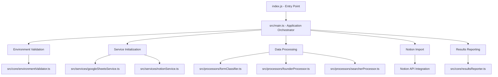

# Moonstone Importer - Architecture Documentation

## 🏗️ TypeScript Architecture Overview

The Moonstone Importer has been completely refactored into a **type-safe, modular TypeScript application**. This document provides a comprehensive overview of the architecture, design decisions, and implementation details.

## 📊 High-Level Architecture



## 📁 Project Structure (TypeScript)

```
MoonstoneImporter-NEW/
├── index.js                           # Legacy entry point (compatibility)
├── src/                              # TypeScript source code
│   ├── main.ts                       # Main application orchestrator
│   ├── types/
│   │   └── index.ts                  # Centralized type definitions
│   ├── config/
│   │   └── constants.ts              # Application constants & configuration
│   ├── core/                         # Core application modules
│   │   ├── environmentValidator.ts   # Environment validation logic
│   │   ├── applicationOrchestrator.ts# High-level workflow orchestration
│   │   └── resultsReporter.ts        # Results display and reporting
│   ├── services/                     # External service integrations
│   │   ├── googleSheetsService.ts    # Google Sheets API client
│   │   └── notionService.ts          # Notion API client with retry logic
│   ├── processors/                   # Data processing modules
│   │   ├── formClassifier.ts         # Form categorization and validation
│   │   ├── founderProcessor.ts       # Founder-specific processing
│   │   └── searcherProcessor.ts      # Searcher-specific processing
│   └── utils/                        # Utility functions
│       ├── textUtils.ts              # Text processing and normalization
│       └── matchingUtils.ts          # Fuzzy matching and data correlation
├── dist/                             # Compiled JavaScript (auto-generated)
├── tsconfig.json                     # TypeScript configuration
├── package.json                      # Dependencies and scripts
└── .gitignore                        # Git ignore rules (includes dist/)
```

## 🎯 Design Principles

### 1. **Type Safety First**

- **Strict TypeScript**: All code uses strict type checking
- **No implicit any**: Every value has an explicit type
- **Compile-time validation**: Errors caught during development
- **Self-documenting**: Types serve as living documentation

### 2. **Modular Architecture**

- **Single Responsibility**: Each module has one clear purpose
- **Loose Coupling**: Modules interact through well-defined interfaces
- **High Cohesion**: Related functionality grouped together
- **Easy Testing**: Modules can be tested in isolation

### 3. **Error Handling**

- **Typed Errors**: Custom error classes with context
- **Graceful Degradation**: Application continues when possible
- **Detailed Logging**: Clear error messages for debugging
- **Retry Logic**: Automatic retry for transient failures

### 4. **Developer Experience**

- **IntelliSense Support**: Full autocompletion and documentation
- **Refactoring Safety**: Compiler-guaranteed code changes
- **Build Validation**: Pre-commit type checking
- **Clear Abstractions**: Easy to understand and modify

## 🔧 Core Modules

### 1. Type System (`src/types/index.ts`)

**Purpose**: Centralized type definitions for the entire application

**Key Types**:

```typescript
// Data structures
export type SpreadsheetRow = string[];
export type FormType = 'founder' | 'founder referral' | 'searcher' | 'searcher referral' | 'unknown';

// Processing results
export interface ProcessingResults {
  processed: number;
  created: number;
  updated: number;
  errors: number;
  unmatchedReferrals?: number;
}

// Validation types
export type ValidLocation = 'Northern Europe' | 'Western Europe' | /* ... */;
export type ValidValuation = '< €5M' | '€5M - €10M' | /* ... */;

// Error types
export class ApplicationError extends Error {
  constructor(message: string, public readonly context?: Record<string, any>);
}
```

**Benefits**:

- ✅ Compile-time type checking
- ✅ IntelliSense autocompletion
- ✅ Self-documenting interfaces
- ✅ Refactoring safety

### 2. Configuration (`src/config/constants.ts`)

**Purpose**: Centralized configuration and constants

**Key Features**:

```typescript
// Form questions with type safety
export const FORM_QUESTIONS: readonly string[] = [
  /* ... */
] as const;

// Validation options with union types
export const VALID_LOCATIONS: readonly ValidLocation[] = [
  /* ... */
] as const;

// Type-safe mappings
export const FORM_TYPE_MAPPINGS: Record<string, FormType> = {
  /* ... */
} as const;

// API configuration
export const API_CONFIG: ApiConfig = {
  GOOGLE_SHEETS: {
    SCOPES: [
      /* ... */
    ],
    RANGE: "A2:ABY",
  },
  NOTION: { RETRY_ATTEMPTS: 7, BASE_DELAY: 600 },
} as const;
```

**Benefits**:

- ✅ Type-safe configuration
- ✅ Compile-time validation of constants
- ✅ Easy modification for non-programmers
- ✅ Immutable data structures

### 3. Environment Validation (`src/core/environmentValidator.ts`)

**Purpose**: Validates environment setup and configuration

**Key Functions**:

```typescript
export function validateEnvironment(): void;
export function getEnvironmentVariables(): EnvironmentVariables;
export function validateEnvironmentVariable(varName: string): boolean;
```

**Features**:

- ✅ Type-safe environment variable access
- ✅ Comprehensive validation checks
- ✅ Clear error messages
- ✅ Configuration summary display

### 4. Service Layer (`src/services/`)

#### Google Sheets Service (`googleSheetsService.ts`)

**Purpose**: Handles all Google Sheets API interactions

**Key Features**:

```typescript
export async function readSpreadsheetData(
  spreadsheetId: string,
  serviceAccountKey: string,
  range?: string
): Promise<SpreadsheetRow[]>;

export function validateGoogleSheetsEnvironment(
  env: Record<string, string | undefined>
): boolean;
```

**Benefits**:

- ✅ Type-safe API responses
- ✅ Automatic retry logic
- ✅ Error handling with context
- ✅ Service account validation

#### Notion Service (`notionService.ts`)

**Purpose**: Handles all Notion API interactions with retry logic

**Key Features**:

```typescript
export function createNotionClient(apiKey: string): NotionClientWithRetry;
export async function appendChildrenSafely(
  blockId: string,
  children: NotionBlock[],
  notionClient: NotionClientWithRetry
): Promise<any>;
```

**Benefits**:

- ✅ Type-safe Notion API wrapper
- ✅ Built-in retry mechanism
- ✅ Rate limiting protection
- ✅ Block manipulation utilities

### 5. Data Processing (`src/processors/`)

#### Form Classifier (`formClassifier.ts`)

**Purpose**: Categorizes and validates form submissions

**Key Functions**:

```typescript
export function classifyFormType(row: SpreadsheetRow): FormType;
export function categorizeAllForms(allRows: SpreadsheetRow[]): CategorizedForms;
export function filterValidForms(categories: CategorizedForms): ValidForms;
```

**Features**:

- ✅ Type-safe form classification
- ✅ Validation with detailed feedback
- ✅ Statistics generation
- ✅ Error handling for invalid data

#### Processor Modules (`founderProcessor.ts`, `searcherProcessor.ts`)

**Purpose**: Handle specific processing logic for different entity types

**Architecture**:

```typescript
export async function processFounders(
  founderRows: SpreadsheetRow[],
  referralRows: SpreadsheetRow[],
  notionClient: NotionClientWithRetry,
  databaseId: string
): Promise<ProcessingResults>;
```

**Benefits**:

- ✅ Separation of concerns
- ✅ Type-safe processing pipelines
- ✅ Consistent result interfaces
- ✅ Easy to extend for new entity types

### 6. Utility Layer (`src/utils/`)

#### Text Utils (`textUtils.ts`)

**Purpose**: Text processing and normalization utilities

**Key Functions**:

```typescript
export function normalizeName(name: string | null | undefined): string;
export function hasContent(text: string | null | undefined): text is string;
export function getFormResponse(
  row: SpreadsheetRow,
  index: number,
  defaultValue?: string
): string;
```

**Features**:

- ✅ Type guards for safe text processing
- ✅ Unicode normalization
- ✅ Null-safe operations
- ✅ Consistent text handling

#### Matching Utils (`matchingUtils.ts`)

**Purpose**: Fuzzy matching and data correlation

**Key Functions**:

```typescript
export function findBestMatch(
  target: string,
  candidates: string[],
  maxDistance?: number
): string | null;
export function debugSearcherReferralMatching(/* ... */): MatchingDebugInfo;
```

**Features**:

- ✅ Levenshtein distance matching
- ✅ Type-safe matching results
- ✅ Debug information generation
- ✅ Configurable matching thresholds

## 🔄 Data Flow Architecture

### 1. **Input Processing**

```
Google Sheets → Raw Data → Type Validation → SpreadsheetRow[]
```

### 2. **Categorization**

```
SpreadsheetRow[] → Form Classification → CategorizedForms → ValidForms
```

### 3. **Processing**

```
ValidForms → Entity Processors → Notion Operations → ProcessingResults
```

### 4. **Output**

```
ProcessingResults → Results Reporter → Console Output + Statistics
```

## 🛡️ Error Handling Strategy

### 1. **Typed Errors**

```typescript
// Application-level errors with context
export class ApplicationError extends Error {
  constructor(message: string, public readonly context?: Record<string, any>);
}

// Service-specific errors
export class ServiceError extends Error {
  constructor(
    message: string,
    public readonly service: "notion" | "google-sheets",
    public readonly originalError?: Error
  );
}

// Validation errors with field information
export class ValidationError extends Error {
  constructor(
    message: string,
    public readonly field?: string,
    public readonly value?: any
  );
}
```

### 2. **Error Propagation**

- **Service Layer**: Catches API errors, wraps in ServiceError
- **Processing Layer**: Validates data, throws ValidationError for invalid input
- **Application Layer**: Catches all errors, provides user-friendly messages

### 3. **Retry Logic**

```typescript
async function withRetry<T>(
  operation: () => Promise<T>,
  options: RetryOptions = {}
): Promise<T> {
  // Exponential backoff with configurable attempts
  // Handles rate limiting and transient failures
  // Type-safe operation wrapper
}
```

## 🚀 Build and Deployment

### 1. **TypeScript Compilation**

```bash
npm run type-check  # Validate types without compilation
npm run build       # Compile TypeScript to JavaScript
```

**Output Structure**:

```
dist/
├── main.js                    # Compiled main application
├── main.js.map               # Source map for debugging
├── main.d.ts                 # Type declarations
├── types/index.js            # Compiled type utilities
├── config/constants.js       # Compiled configuration
├── core/                     # Compiled core modules
├── services/                 # Compiled services
├── processors/               # Compiled processors
└── utils/                    # Compiled utilities
```

### 2. **Development Workflow**

```bash
npm run dev        # Direct TypeScript execution (development)
npm start          # Compiled JavaScript execution (production)
```

### 3. **GitHub Actions Integration**

```yaml
- name: Type check TypeScript
  run: npm run type-check

- name: Build TypeScript
  run: npm run build

- name: Run application
  run: npm start
```

## 📊 Performance Considerations

### 1. **TypeScript Compilation**

- **Development**: Direct execution with `tsx` for fast iteration
- **Production**: Pre-compiled JavaScript for optimal runtime performance
- **Source Maps**: Available for debugging compiled code

### 2. **Memory Management**

- **Streaming Processing**: Large datasets processed in chunks
- **Type-Safe Buffers**: Controlled memory usage with typed interfaces
- **Garbage Collection**: Proper cleanup of resources

### 3. **API Rate Limiting**

- **Retry Logic**: Exponential backoff for rate-limited requests
- **Batch Operations**: Grouped API calls where possible
- **Circuit Breaker**: Fail-fast for persistent API issues

## 🔧 Extensibility

### 1. **Adding New Form Types**

```typescript
// 1. Update type definition
export type FormType = "founder" | "searcher" | "referral" | "investor"; // ← New type

// 2. Add to mappings
export const FORM_TYPE_MAPPINGS: Record<string, FormType> = {
  "i am an investor looking for opportunities": "investor", // ← New mapping
};

// 3. Create processor
export async function processInvestors(/* ... */): Promise<ProcessingResults> {
  // Implementation
}

// 4. Update orchestrator
// TypeScript will show compilation errors for missing cases
```

### 2. **Adding New Validation Rules**

```typescript
// Add to validation types
export type ValidInvestorType = "Angel" | "VC" | "PE" | "Corporate";

// Update validation functions
export function validateInvestorData(row: SpreadsheetRow): boolean {
  // Type-safe validation logic
}
```

### 3. **Extending API Integrations**

```typescript
// New service interface
export interface SlackClientWithRetry {
  chat: {
    postMessage: (args: any) => Promise<any>;
  };
}

// Implementation with retry logic
export function createSlackClient(token: string): SlackClientWithRetry {
  // Type-safe client wrapper
}
```

## 🎯 Benefits of TypeScript Architecture

### 1. **Development Experience**

- ✅ **IntelliSense**: Full autocompletion and parameter hints
- ✅ **Refactoring**: Safe, automated code changes
- ✅ **Navigation**: Jump to definitions and find references
- ✅ **Documentation**: Inline type information

### 2. **Code Quality**

- ✅ **Compile-time Validation**: Errors caught before runtime
- ✅ **Type Safety**: Prevents common JavaScript errors
- ✅ **Self-Documenting**: Types serve as living documentation
- ✅ **Consistency**: Enforced interfaces across modules

### 3. **Maintainability**

- ✅ **Easier Onboarding**: New developers understand code faster
- ✅ **Safer Changes**: Compiler prevents breaking changes
- ✅ **Better Testing**: Type-safe test interfaces
- ✅ **Long-term Stability**: Reduced technical debt

### 4. **Production Reliability**

- ✅ **Fewer Runtime Errors**: Type checking prevents common bugs
- ✅ **Better Error Messages**: Structured error handling
- ✅ **Performance**: Compiled JavaScript runs efficiently
- ✅ **Monitoring**: Type-safe logging and metrics

## 🔮 Future Enhancements

### 1. **Enhanced Type Safety**

- Branded types for IDs and tokens
- Template literal types for dynamic validation
- Conditional types for complex business logic

### 2. **Advanced Features**

- GraphQL integration with generated types
- Real-time processing with WebSocket types
- Advanced caching with typed storage

### 3. **Developer Tooling**

- Custom ESLint rules for business logic
- Automated API documentation generation
- Type-driven test generation

The TypeScript architecture provides a solid foundation for scalable, maintainable, and reliable form processing automation! 🚀
